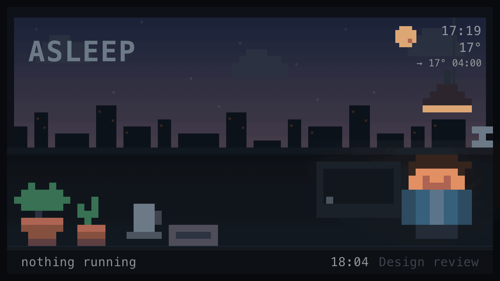
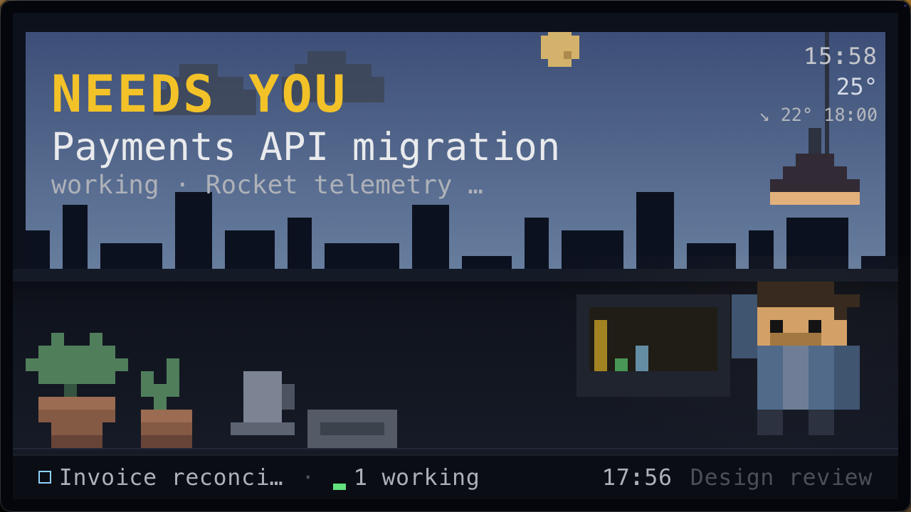
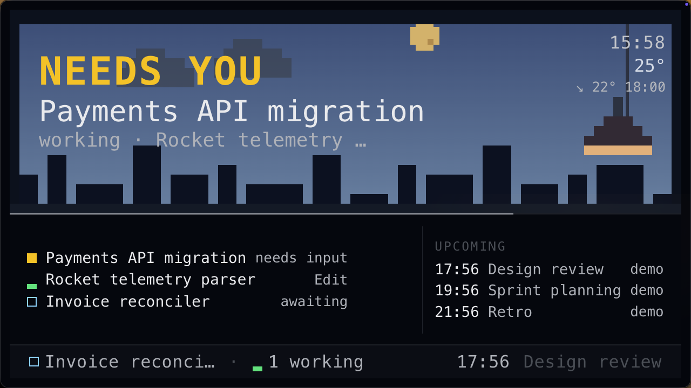

# Glance

A small always-on panel that shows what Claude Code is doing across every
session on your machine — and takes over when a meeting is about to start.

It is furniture, not an app. Most of the day it is peripheral vision. You glance
at it; you never study it.



*The whole ladder in 20 seconds: idle, working, needing you, the peek overlay,
then a meeting closing in until the panel locks — and stands down when you
acknowledge it.*

## What it does

- **Tracks every Claude Code session** on the machine — idle, working, waiting
  on you, blocked on you — by session title, not by folder.
- **Escalates before a meeting.** A ladder at T-10, T-5 and a T-2 lock, then
  three tiers of increasingly hard-to-ignore *late*.
- **One key.** A single global hotkey dismisses a meeting, acknowledges one that
  has started, or opens a list of everything. There is no other input.
- **Reads your real calendars** — published `.ics` feeds, and on macOS the local
  Calendar store, which includes work accounts that cannot publish a feed.
- **Weather and a day cycle**, so the panel looks like a room rather than a
  readout.

### Blocked on you



### One key opens everything



*Sessions on the left, upcoming meetings on the right, for a few seconds.*

## What you need

| | |
|---|---|
| A screen | Any HDMI display. A 5-7" panel is about $40. See [docs/HARDWARE.md](docs/HARDWARE.md) |
| A case | Optional. 3D-printable, or any stand |
| Node | 22 or newer (uses the built-in `node:sqlite`) |
| macOS | For the Electron wrapper and the local calendar reader. The server and client are portable; the wrapper is not |

The panel is a second display. Nothing talks to the screen directly — there is
no SDK and no firmware, which is the point: any panel works.

## Install

```sh
git clone <this repo> glance && cd glance
cp glance.env.example glance.env      # edit it
cd app && npm install && cd ..
node server.js                        # then: cd app && npm start
```

Merge `hooks.snippet.json` into `~/.claude/settings.json` so Claude Code reports
to it. **Back that file up first and merge additively** — it probably already
has content:

```sh
cp ~/.claude/settings.json ~/.claude/settings.json.bak-$(date +%s)
```

The hook URL is `http://127.0.0.1:7777/hook`, deliberately not `localhost` — on
macOS that can resolve to `::1` while the server binds IPv4, and the failure is
silent.

For it to start at login, see [docs/AUTOSTART.md](docs/AUTOSTART.md).

## How it is put together

**The server owns every decision.** `compute()` decides what is on screen; the
client renders the payload and never makes a priority judgement. If you find
yourself writing an `if` about urgency in the client, it belongs in `compute()`.

**`/hook` answers `204` before doing any work.** HTTP hooks block the Claude
Code session while they run, so any latency added there shows up in your
terminal.

**Nothing persists.** Session state is in memory. No prompts, no file paths, no
transcripts are written anywhere.

**All display sizing is in `vmin`, never `px`**, because the backing scale of a
cheap panel is not something to depend on.

**One thing at a time.** Four lines of ~28 characters plus a one-line strip,
read at arm's length. If you are tempted to add a fourth element to a screen,
don't.

## Configuration

Everything lives in `glance.env`. See `glance.env.example` for the full set;
the ones most people want:

```sh
export GLANCE_ICS_FAMILY="webcal://..."   # any published calendar
export GLANCE_LOCALCAL="1"                # macOS local store (needs Full Disk Access)
export GLANCE_LATLON="51.48,0.00"         # weather; Greenwich — use yours
export GLANCE_MASCOT="you-b"              # who stands on the desk
export GLANCE_PANEL_W="1024"              # if your screen is not 1280x720
```

## The character

Six generic avatars ship with it. Making your own from a photo, or from a
description, is documented in [docs/AVATARS.md](docs/AVATARS.md) — the sheet
contract is ten rows by four frames on a 16x16 grid, and any sheet that meets it
works with every state and escalation tier unchanged.

## Why it looks like this

The rules are written up in [docs/DESIGN.md](docs/DESIGN.md) — the ten states,
why colour is never the only signal, why the strip is a hint channel rather than
a roll-up channel, and a list of things that were tried and rejected with the
reasons. Read it before changing anything visual; most of it was arrived at by
getting it wrong first on real hardware.

## Prior art and thanks

The visual design is a system called Glance, produced with Claude Design. Its
rules — one accent per state, shape-encoded pips so the panel survives
desaturation, `steps()` motion only, no hover states because there is no pointer
— are what make it readable at distance rather than merely pretty.

## Licence

MIT. See [LICENSE](LICENSE).
